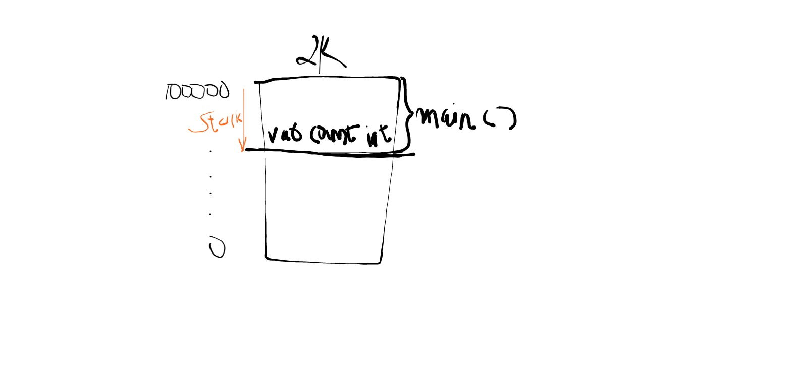
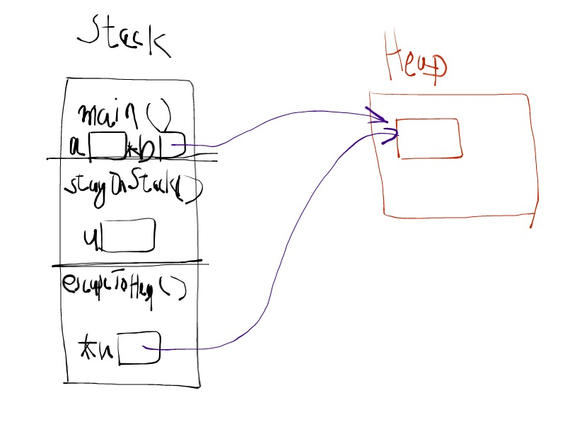
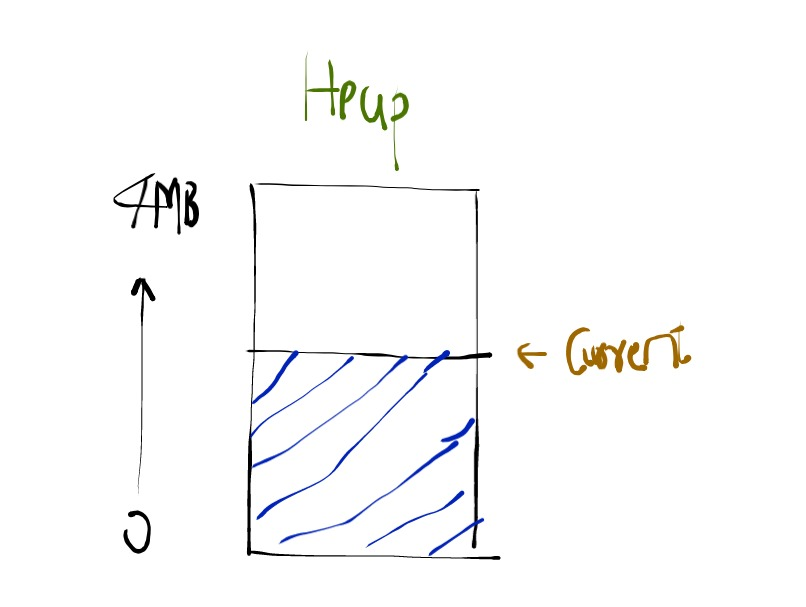
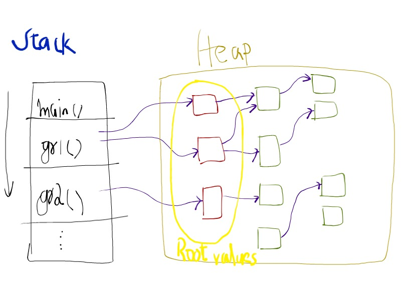
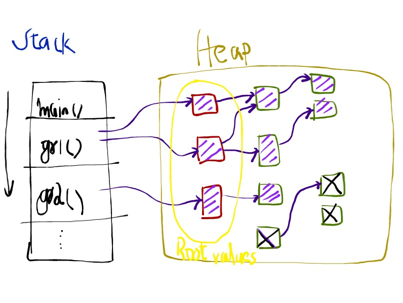

# Go:
    1. Speed
    2. Concurrency

Use the right programming patterns for optimal performance. (Design guidelines)

Go's execution model is the actual machine and not a virtual machine (as in the case of Java)

Variable Types: how much memory is the variable going to use?

Word: AMD64 architecture (CPU hardware) => 1 word = 64 bits
Pointers need to be of the same size as the word size in order to store addresses
int: size = 64 on a 64 bit architecture since pointers are integers too

Address size = Word size = Integer size

# Zero values
Every variable in Go must be initialized. If the programmer does not do this, the variable is intialized to its zero-value (all bits set to zero)

# Strings

**Size**: 2 words
- Word 0: pointer to a backing array of bytes. Zero values = nil
- Word 1: Size. Number of bytes. Zero value = 0

## Example:
```go
    a := "hello"
```        
- Backing array: 5 bytes backing array to hold the binary representation of "hello" 
- Word 0: A pointer that stores the starting address of the backing array
- Word 1: 5


# Casting
Go does not support type casting. Instead it requires the programmer to perform a type conversion that looks like a function call

# Struct alignment
## Example 1: Bad alignment

```go
type example struct {
    flag bool       // 1 byte
    counter int16   // 2 bytes
    pi float32      // 4 bytes
}
```
**Alignment:**
- A 2 bytes value must fall on a 2 byte alignment position (Bit 0, bit 16, bit 32 ....)
- A 4 bytes value must fall on a 2 byte alignment position (Bit 0, bit 32, bit 64 ....)

Bit positions
1. 0-7 : bool 
2. 8-15: one padded byte in order to fit the next int16 variable
3. 16-31: int16
4. 32-63: float32

> Total space: 64 bits = 8 bytes!


## Example 2: Good alignment -> Order the LARGEST type FIRST in a struct
```go    
type example struct {
    pi float32      // 4 bytes
    counter int16   // 2 bytes
    flag bool       // 1 byte
}
```
**Alignment:**
- A 2 bytes value must fall on a 2 byte alignment position (Bit 0, bit 16, bit 32 ....)
- A 4 bytes value must fall on a 2 byte alignment position (Bit 0, bit 32, bit 64 ....)

**Bit positions**
1. 0-31: float32
2. 32-47: int16
3. 48-55: bool

> Total space: 56 bits = 7 bytes! (Space savings)

# Pointers
- Everything in Go is pass-by-value
- Pointers == "sharing" between program boundaries (example: function calls)

# Go routines
- They are threads
- They could have multiple functions within them
- Each Go routine is allocated a stack
- Every time a function is executed a portion of the stack is allocated to that function

> *Note: Every stack in Go starts initially with a size of 2KB*

Stacks in generally grow "downwards" (higher to lower addresses)


> *Note: The size of every stack is known at compile time. Anything whose size cannot be determined at compile time has to go to the heap and not to the stack*

# Heap allocation

**Example:**
```go
package main

type user struct {
	name string
	email string
}

// Memory is allocated on the stack
func stayOnStack() user {
	u := user {
		name: "Alice",
		email: "alice@abc.com",
	}
	return u
}

// Memory will be allocated for this function on the heap
// because this function returns a pointer to a variable that is
// created within the function. If this function were to be allocated memory on the stack the variable would be
// immediately erased when the function returns and thus the pointer returned would point to an address that has been deallocated.
// The Go compiler automatically detects this possibility (escape analysis) and allocates memory on the heap instead, thus preventing deallocation
func escapeToHeap() *user {
	u := user {
		name: "Bob",
		email: "bob@xyz.com",
	}
	return &u
}

func main() {
	a := stayOnStack()
	b := escapeToHeap()

	println("a: ", a.name, a.email, &a)
	println("b: ", b.name, b.email, &b)
}
```

# Stack vs Heap
- Stack: a private space for a function/thread
- Heap: space for storing items that are to be SHARED outside of the function



> *Escape analysis: Helps determine whether to allocate memory on the stack or the heap*

# How stacks grow
- Every Go routine has a stack allocated to it

- When the initial stack allocation of 2KB runs out, a larger stack is created (e.g 4KB), the values in the current stack are copied over to the new stack, pointers within the new stack are updated with the new addresses and the old stack is deallocated.

- The benefit of having smaller stacks justifies the cost of this copy operation (which hopefully does not take place too often)

> *Note: There should never be a pointer in one stack that points to an address in another. This would be a huge disaster given that stacks get reallocated and the cost of updating these pointers could be immense (the pointers could form a messy graph)*

Example:
```go
package main

const Size = 512
const Maxdepth = 5000

func stackCopy(s *string, recursion_depth int, dummy [Size]int16) {
	recursion_depth++
	println("Depth: ", recursion_depth, " s: ", s, )
	if recursion_depth > Maxdepth {
		return
	}
	stackCopy(s, recursion_depth, dummy)
}


func main() {
	s := "12345"
	recursion_depth := 0

	// Initial stack for Go: 2 KB
	dummy := [Size]int16{} // Size * 2 bytes = 512 * 2 bytes = 1 KB
	stackCopy(&s, recursion_depth, dummy)
}
```
Output:
```
Depth:  1  s:  0xc000083f78
Depth:  2  s:  0xc000083f78
Depth:  3  s:  0xc000083f78
Depth:  4  s:  0xc000083f78
Depth:  5  s:  0xc000095f78
Depth:  6  s:  0xc000095f78
Depth:  7  s:  0xc000095f78
Depth:  8  s:  0xc000095f78
Depth:  9  s:  0xc000095f78
Depth:  10  s:  0xc000095f78
```

> In the aboce output, the address for the string pointer has changed at Depth = 5. This means the stack has been reallocated

# How heaps function
- Clearing memory: performed by the garbage colector (GC)
- Pacing algorithm: How often does the garbage collector run in order to maintain a low heap size without affecting performance much. This is a very sophisticated algorithm

- If the garbage collector is running and another Go routine that is concurrently running suddenly starts filling up the heap, the GC puts it on halt (and forces it to participate in garbage collection - not clear how yet)
- If the heap runs out despite garbage collection, a larger heap has to be allocated. This is generally a costly operation

# Garbage Collection
- At the beginning of garbage collection, every Go routine is told that the GC is running
- Every Go routine is instructed to start using the "write barrier".
- The write barrier is a tiny function that causes each Go routine to scan its stack for pointers to addresses that are in the heap. Such pointers are called "Root objects". The values pointed to by these pointers are called "Root values"

- Every root value in the heap can be put into a queue (for BFS scanning??)
- From the root values, connected components are computed and the other objects in the heap can be removed

- While the Go-routines "color" the heap objects, they are stalled lest the graph changes if they are allowed to keep running. Garbage collection in Go is so well designed that it takes no more than a microsecond typically

# Constants
- Go has implemented some novelty when it comes to constants
- Constants exist as literal values ONLY during compile time
- They are NOT implemented as read-only variables post compilation.
- Constants in Go can have upto 256 bits of precision
- Constants can be either typed or untyped
- Untyped constant are considered to be of a "kind"